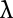
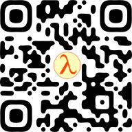

% Введение в лямбда-исчисление
% Михаил Беляев
% \today

## В предыдущей серии

\centering

В начале была буква!

{ height=15em }

## В предыдущей серии

Алонзо Чёрч, 30е годы, научник некоего Алана Тьюринга

По сути, язык программирования, в котором нет вообще ничего, кроме простых функций

Что это значит на практике?

Всё --- это функция **от одного аргумента**

## Disclaimer

Всё, что будет дальше в этой лекции --- просто математическая абстракция, даже если она выглядит как код.
Вопросы производительности, читаемости и т.д. здесь не рассматриваются вовсе.

\begin{flushright}
\vfill
\includegraphics[height=0.4\textheight]{fig/trust-me-i-m-a-scientist.jpg}
\end{flushright}

## Принцип аппликации и абстракции

Объявление функции --- лямбда-выражение
$\lambda\,x. F[x]$

Функция, которая принимает аргумент (x) и возвращает его же:
$\lambda\,x. x$

## Принцип аппликации и абстракции

Что можно делать со значениями в этой системе?

- Заворачивать в новые функции
- Применять функции к аргументам: $x\,y$
- **Больше ничего**

Выражения бывают трёх видов:

- Лямбда-выражения
- Применения одних выражений к другим
- Переменные

## Как происходит вычисление?

$\alpha$-конверсия:
$\lambda\,x.M[x] \rightarrow \lambda\,y.M[y]$

Альфа-конверсия всегда корректна для любого выражения, т.е. можно свободно переименовывать переменные в лямбдах:

$\lambda\,x.x (\lambda\,z.z\,x) \rightarrow \lambda\,y.y (\lambda\,z.z\,y)$

Выражения, одинаковые с точностью до альфа-конверсии, называются альфа-эквивалентными

## Как происходит вычисление?

$\beta$-редукция:
$(\lambda\,x.M[x]) y \rightarrow M[x := y]$

(читать как "заменить все вхождения $x$ внутри $M$ на $y$")

Бета-редукция приводит выражение к бета-нормальной (конечной) форме, если завершается за конечное число шагов

Выражения, бета-нормальная форма которых совпадает, называются бета-эквивалентными

## Шаг в сторону: каррирование

- Выше мы писали, что все функции только от одного аргумента
- А если мы хотим больше???

$\lambda\,x\,y. f\,y\,x$

. . .

Это **ровно то же самое**, что и
$\lambda\,x . \lambda\,y . f\,y\,x$

## Шаг в сторону: каррирование

В каком смысле то же самое?

$(\lambda\,x . \lambda y . f\,y\,x) a\,b \rightarrow$
$(\lambda\,y . f\,y\,a) b \rightarrow$
$f\,b\,a$

## Шаг в сторону: каррирование

- Каррирование позволяет выражать функции от любого числа аргументов $\geq 1$
- Функция от $N$ аргументов --- это функция от одного аргумента, возвращающая функцию от $N - 1$ аргументов
- Запомните этот слайд)

## И что дальше?

- Собственно, всё, у нас есть язык программирования
- А что с данными???

## Вот тут начинается самое интересное

- Очевидно, одних только функций недостаточно
- Но это неточно

## Булеаны Чёрча

\begin{align*}
\texttt{true} &:= \lambda\,x\,y.x \\
\texttt{false} &:= \lambda\,x\,y.y \\
\texttt{if} &:= \lambda\,c\,t\,f.c\,t\,f
\end{align*}

\begin{align*}
\texttt{if}\,\texttt{true}\,a\,b &\rightarrow a \\
\texttt{if}\,\texttt{false}\,a\,b &\rightarrow b
\end{align*}

## Булеаны Чёрча

Как определить отрицание?

. . .

\begin{align*}
\texttt{not} &:= \lambda\,b\,x\,y.b\,y\,x\\
\end{align*}

## Нумералы Чёрча

- Логические значения это хорошо, но слишком просто
- Как насчёт чисел?

## Нумералы Чёрча

- Натуральные числа
- За основу возьмём числа Пеано
- Есть 0 и операция (+1)

## Нумералы Чёрча

\begin{align*}
\texttt{0} &:= \lambda\,f\,y.y \\
\texttt{1} &:= \lambda\,f\,y.f\,y \\
\texttt{2} &:= \lambda\,f\,y.f\,(f\,y) \\
\texttt{3} &:= \lambda\,f\,y.f\,(f\,(f\,y)) \\
&\ldots
\end{align*}

Т.е. число $N$ это функция от $f$ и $x$, которая применяет $f$ к $x$ $N$ раз

## +1

\begin{align*}
\texttt{0} &:= \lambda\,f\,y.y \\
\texttt{inc} &:= \lambda\,n\,f\,y.f(n\,f\,y) \\
\end{align*}

Просто применили функцию $f$ на один раз больше

## Сложение

\begin{align*}
\texttt{+} &:= \lambda\,a\,b\,f\,y.a\,f(b\,f\,y) \\
\end{align*}

## -1

Нужно применить функцию *на один раз меньше*

Общая идея: сделать такие $f$ и $y$, чтобы первое применение ничего не делало

. . .

\begin{align*}
\texttt{dec} &:= \lambda\,n\,f\,y.n\,(\lambda\,g\,h.h (g\,f)) (\lambda\,q.y) (\lambda\,u.u) \\
\end{align*}

\begin{flushright}
\vfill
\includegraphics[height=0.4\textheight]{fig/too-complex.png}
\end{flushright}

## Другие операции

\begin{align*}
\texttt{isZero} &:= \lambda\,n.n (\lambda\,x.\texttt{false}) \texttt{true} \\
\texttt{-} &:= \lambda\,m\,n.n\,dec\,m \\
\texttt{*} &:= \lambda\,m\,n.n\,(+\,m)\,0
\end{align*}

## Проверочные вопросы

- Как сравнить два числа на равенство?
- Как выразить целые числа?
- Рациональные числа?
- Возведение в степень?

## Чего ещё не хватает для полноценного языка программирования?

- Структуры данных?
- Циклы?

## Структуры данных: пары Чёрча

\begin{align*}
\texttt{pair} &:= \lambda\,a\,b\,f.f\,a\,b \\
\texttt{first} &:= \lambda\,p.p(\lambda\,a\,b.a) \\
\texttt{second} &:= \lambda\,p.p(\lambda\,a\,b.b) \\
\end{align*}

Как это работает?

## Принцип замыкания (closure)

Все символы, которые были видны в функции на момент её создания, доступны внутри этой функции даже после её создания

Т.е. каждая функция может потенциально хранить в себе кучу данных

## Структуры данных: пары Чёрча

\begin{align*}
\texttt{pair}\,x\,y &\rightarrow \lambda\,f.f\,x\,y \\
\texttt{first} (\texttt{pair}\,x\,y) &\rightarrow x \\
\texttt{second} (\texttt{pair}\,x\,y) &\rightarrow y \\
\end{align*}

## Другие структуры данных

- Они не нужны
- Пар достаточно для выражения любой сложносвязной структуры в стиле ФП
  Списки Чёрча: список = ничего или пара из первого элемента и списка

## Что с циклами и/или рекурсией?

- На прошлой лекции говорилось, что циклы бессмысленны без переменных
- Забыли про циклы
- Что с рекурсией?

## M-комбинатор aka Mockingbird

\begin{align*}
m &:= \lambda\,x.x\,x
\end{align*}

## $\omega$-комбинатор

\begin{align*}
\omega &:= m\,m
\end{align*}

## $\omega$-комбинатор

\begin{align*}
\omega &:= m\,m \\
{}     &\rightarrow (\lambda\,x.x\,x) (\lambda\,x.x\,x) \\
\end{align*}

Что произойдёт, если попытаться это вычислить?

\begin{flushright}
\vfill
\includegraphics[height=0.4\textheight]{fig/i-heard-you-like-functions.png}
\end{flushright}

## $\omega$-комбинатор

- Самый простой **дивергентный** комбинатор
- Переписывается сам в себя
- Бесконечная рекурсия, но совершенно бесполезная =(
- Расходящихся комбинаторов можно придумать бесконечно много

## Y-комбинатор

\begin{align*}
y &:= \lambda\,f.(\lambda\,x.f (x\,x)) (\lambda\,x.f (x\,x))
\end{align*}

- a.k.a. комбинатор наименьшей неподвижной точки
- Позволяет выразить произвольную рекурсию, **которая ещё и что-то полезное делает**
- Подробности узнаем когда-нибудь потом

\begin{flushright}
\vfill
\includegraphics[height=0.4\textheight]{fig/too-complex.png}
\end{flushright}

## Сегодня мы многое поняли

- Можно построить систему, в которой нет вообще ничего, кроме анонимных функций
- При этом, она будет полноценным языком программирования!
    - Абстракция
    - Данные и структуры данных
    - Конечная и бесконечная рекурсия
- Даже Тьюринг-полным (хоть я об этом и не рассказал)

## Где можно это всё потыкать

- Берёте любой динамический язык программирования с лямбдами

<https://jacksongl.github.io/files/demo/lambda/index.htm>

Реализация на котлине:
<https://github.com/belyaev-mikhail/lambdas>

\begin{flushright}
\vfill
\includegraphics[height=0.5\textheight]{fig/ya-sdelal.png}
\end{flushright}

## Кем реально используется лямбда-исчисление

- Учёными: для тестирования идей
- Дизайнерами языков: чтобы не изобретать велосипеды [^*]

[^*]: Не помогает

## Что ещё бывает

- То, что мы рассмотрели сегодня --- это простое нетипизированное лямбда-исчисление
- Соответственно, бывает ещё сложное и типизированное

## Исчисление комбинаторов (базис SKI)

Есть три функции:

\begin{align*}
i &:= \lambda\,x.x \\
k &:= \lambda\,x\,y.x \\
s &:= \lambda\,x\,y\,z.(x\,z) (y\,z) \\
\end{align*}

Утверждается, что через эти три функции можно выразить любые другие.

\pause

На самом деле, их две: $i = s\,k\,k$

## Исчисление комбинаторов (базис SKI)

Утверждается, что через эти три функции можно выразить любые другие.

\begin{align*}
\omega &:= (s\,i\,i)(s\,i\,i) \\
y &:= (s\,s\,k)((s\,(k\,(s\,s\,(s\,(s\,s\,k)))))\,k) \\
\texttt{true} &:= k \\
\texttt{false} &:= k\,i \\
&\hdots
\end{align*}

>	Raymond Smullyan, To Mock a Mockingbird and Other Logic Puzzles: Including an Amazing Adventure in Combinatory Logic

## Что ещё бывает

- $\mu$-рекурсивные функции
- Другие полные базисы (не SK)

## В следующей серии

- Будем учить этот ваш Хаскель!

##

{ width=40% } \hfill { width=40% }

