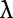
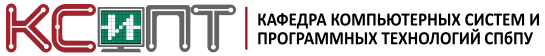

% Введение в функциональное программирование
% Михаил Беляев
% \today

## Самый Важный Слайд

:::::::::::: { .columns }
:::{ .column width=60% }
* Будут лекции
* Будет экзамен
* Будут упражнения
* Автоматов **нет**
* Есть домашки
* Слайды выкладываются
* Апдейты через группу в TG $\rightarrow$
:::
:::{ .column width=40% }
{ width=100% }
:::
::::::::::::

https://t.me/joinchat/u7ojZgHjicRlZjUy

## Начнём с вопросов

- Какие вы знаете языки программирования?
- Какие языки программирования вообще бывают?

## Императивное программирование

- Программа --- это набор *инструкций*, изменяющих *состояние* системы
- Всё остальное (процедуры, классы и т.д.) --- лишь способы абстракции

```Cpp
    long factorial(long i) {
        long result = 1;
        while(i > 1) {
            result = result * i;
            --i;
        }
        return result;
    }
```

## Императивное программирование: более формально

Выполнение программы --- это переход между состояниями

$\sigma_0 \rightarrow \sigma_1 \rightarrow \sigma_2 \rightarrow \sigma_3 \rightarrow \sigma_4 \rightarrow \ldots \rightarrow \sigma_{s}$

## Императивное программирование: языки

Как процедурные, так и объектные языки

Начиная от Fortran и Algol и заканчивая Java и C#

## Функциональное программирование

- Программа --- это выражение, которое можно вычислить
- Способы абстракции бывают так же разными

```Cpp
    long factorial(long i) {
        return (i <= 1)?
               1 :
               i * factorial(i-1);
    }
```

- Выполнение программы --- это вычисление этого выражения

## Функциональное программирование: языки

Начиная от первых диалектов LISP до Haskell и F#

## Декларативное программирование

- Функциональный стиль программирования --- частный случай *декларативного* стиля

. . .

- Императивная программа отвечает на вопрос "как?"
- Декларативная программа отвечает на вопрос "что?"

## Декларативное программирование

Что ещё относится к декларативному стилю?

- Языки разметки
    * XML и языки на его основе,...
- Логические языки
    * Prolog, Datalog, ...
- Реляционные языки
    * SQL, SparQL, ...

## Современные языки

- Современные языки имеют широкий инструментарий для работы в стиле ФП
- Как в основном императивные, так и в основном функциональные языки пришли к некоему "гибридному" состоянию

Модно, молодёжно: Rust, Swift, Kotlin, Scala, Go, etc.

- "Старые" языки последних стандартов тоже не отстают
  Java 8+, C++11+, C# 4+, etc.

## Немного истории

В начале было слово?

. . .

LISP

. . .

- 1958 год
- Первый функциональный язык программирования
- Рекурсия, условные выражения, лямбда-функции
- Динамическая типизация
- Сборка мусора
- Крайне простой синтаксис

## Пример кода на LISP

```Haskell
    (defun (fibonacci (n))
        (if (or (= n 0) (= n 1))
            1
            (+
                (fibonacci (- n 1))
                (fibonacci (- n 2))
            )
        )
    )
```

## Ещё немного истории

\centering

В начале была буква!

{ height=15em }

## Лямбда-исчисление

Алонзо Чёрч, 30е годы XX века

. . .

Два основных принципа --- *аппликация* и *абстракция*

. . .

Абстракция через $\lambda$-терм:

> $\lambda$ x. \<выражение над x\>

. . .

Аппликация (применение функции к аргументу):

> f x

. . .

Вычисление = "переписывание" термов:

> ($\lambda$ x. y) a $\rightarrow$ y[a/x]

"Заменить все вхождения x внутри y на а"

## Лямбда-исчисление

- Можно ввести рекурсию через т.н. Y-комбинатор
- Можно определить структуру данных --- пару
- Можно определить логические (Church booleans) и натуральные (Church numerals) значения
- Через натуральные числа можно определить целые и вещественные

. . .

На выходе имеем Тьюринг-полный язык программирования

## Лямбда-исчисление

По сути, язык программирования, в котором нет вообще ничего, кроме простых функций

Вводит многие из основных черт ФП:

- Функции --- это данные, а данные --- это функции
- Захват переменных из контекста (closures)
- Полнота через рекурсию
- Каррирование (currying)

## А потом уже был LISP

* 1958 год, Стив Рассел (Steve Russell)
* LISt Processor
* Lots of Irritating Stupid Parentheses
* Lost In a Sea of Parentheses
* etc.

## LISP: базовый синтаксис

* Всё --- это линейный список

. . .

* Программа это тоже линейный список

. . .

* Всего два служебных символа --- "(" и ")".

  Первый элемент списка --- это функция, дальше --- её аргументы  
  (aka прямая польская запись)

```Haskell
  (* (+ 1 1) (sin (/ pi 2)))
```

## LISP: особенности

- Идея о том, что код `==` данные, возведена в абсолют
- Можно модифицировать и генерировать код как данные
- Нет отдельного синтаксиса для данных
- Предельная простота разбора и манипуляций с кодом

## Дальше

* ML --- Робин Милнер (Robin Milner) --- 1970е
    * Вывод типов (Type inference)
    * Алгебраические типы данных
* Miranda --- Девид Тёрнер (David Turner) --- 1985
    * Call-by-name evaluation strategy (lazy evaluation)

## Дальше

* Erlang --- Ericsson --- 1986
    * LISP + Prolog + ...
    * Сверхпараллельность
    * Модель акторов
    * "Let it crash"

## Интерлюдия

Дано: существует важная задача X и 25 способов её решения.

. . .

Лучшие умы человечества собираются вместе, чтобы раз и навсегда
представить один самый лучший способ.

. . .

Долгие годы работы, кропотливый труд, радость свершения.

. . .

Итог: существует важная задача X и **26** способов её решения.

## Язык Haskell

Решение о создании языка было принято на конференции на тему
функционального программирования и компьютерной архитектуры
(FPCA ’87) в Портленде, штат Орегон.

##

Haskell --- 1990 --- $>20$ специалистов из TOP100 в области языков

* Вершина функциональной мысли на момент создания
* Чисто функциональный язык программирования
* Строгая статическая типизация
* Вывод типов
* Ленивое выполнение

## Текущее положение дел

* LISP продолжает развитие в виде BPCL, Racket, Clojure
* ML продолжает развитие в виде OCaml/F#
* Erlang живее всех живых
* ФП активно двигается в веб:
    * Purescript/Elm/Haskell/OCaml

## Текущий тренд: гибридизация

* Scala --- EPFL --- 2003
    * Java + Haskell
    * Попытка "поженить" ООП и ФП со стороны ООП

* F# --- Microsoft --- 2005
    * OCaml + C#
    * Попытка "поженить" ООП и ФП со стороны ФП

* Swift/Rust/Kotlin/Dart и так далее
    * Все заявляют ФП как одну из основных "фишек"
    * На практике это неудачные попытки поиска золотой середины

## Что же такое функциональное программирование

Что такое функция в программировании?

. . .

Что такое функция в математике?

. . .

Чистая функция --- это функция и в математическом, и в программном смысле

. . .

Можно ли написать что-то реально работающее только на чистых функциях?

## Что же такое функциональное программирование

Чистая функция --- это функция, не содержащая *побочных эффектов*

. . .

Всё является функциями, причём чистыми

. . .

* Переменных нет, есть только константы
* Циклов нет --- они бессмысленны без переменных

## Побочные эффекты

* Любой ввод-вывод
* Модификация внешнего состояния (глобальные и локальные переменные)

. . .

Являются ли два определения чистой функции тождественными?

Т.е. означает ли отсутствие побочных эффектов то, что для одних и тех же аргументов
всегда будет выдан один и тот же результат?

## Функции --- полноценные значения

* Раз все значения являются функциями, то функции являются значениями
    * Функции можно передавать как параметры в другие функции
    * Функции можно создавать на лету (лямбда-выражения) и возвращать
      как значения

* Функции высших порядков --- функции, оперирующие функциями

## Функции высших порядков: примеры

* `map` --- отображение коллекции аргументов на коллекцию результатов  
  `map (+1) [1,2,3,4]` $\rightarrow$ `[2,3,4,5]`
* `filter` --- выделение элементов из коллекции по предикату  
  `filter (<0) [-2,-1,0,1]` $\rightarrow$ `[-2,-1]`

## Другие ограничения чисто функционального кода

\setmonofont[Scale=0.8]{Fira Sans}

* Многие структуры данных подразумевают изменяемое состояние
    * Простейший пример --- массивы
    * Чтобы получить изменённый массив, нужно скопировать старый, что обычно неприемлемо
    * Аналогично с изменяемыми ссылками

## Что делать?

\setmonofont[Scale=0.8]{Fira Sans}

* Нужно использовать неизменяемые (immutable) структуры данных
    * Константные массивы
    * Односвязные списки
    * Деревья
    * Более сложные связные структуры
* Неизменяемость даёт много плюсов, но в среднем гораздо сложнее для понимания
    * "Дешёвая" параллельность
    * Персистентные структуры данных --- хранение истории с экономией памяти
    * Более чёткая и формальная структура кода

## О чём этот курс

- Парадигма функционального программирования и её отличия от привычных вам
- Язык Haskell
- Неизменяемые структуры данных и алгоритмы на их основе

## FAQ

### Почему именно Haskell?

Потому, что на нём **максимально неудобно** писать в нефункциональном стиле

### Где реальное применение ФП??77&?

Его более, чем достаточно

##

{ width=60% } \hfill { width=20% }

\vfill

<http://kspt.icc.spbstu.ru/course/lang>
<belyaev@kspt.icc.spbstu.ru>

{ height=1.5em } { height=1.5em }
