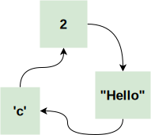

% Как прекрасно быть ленивым
% Михаил Беляев

## Вспомним первые лекции

- Haskell --- *ленивый* язык программирования
- Если быть точным, то call-by-need

Что это значит?

## Call-by-need evaluation

- Значение считается только тогда, когда нужно
- Значения без параметров можно посчитать только один раз
   - Это также называется *мемоизацией*

## Ленивость на уровне структур данных

- Структуры данных в Haskell тоже ленивые!

``` haskell
x = Just $ error "Ooops!"
isNothing Nothing = True
isNothing _       = False
...

isNothing x -- does not crash!
```

## Ленивость на уровне структур данных: списки

- Списки тоже ленивые

``` haskell

list = [0, 1, 2, 3, error "Slap!", 5]

...
show $ take 3 list -- [0, 1, 2]
show $ take 5 list -- Slap!

```

## Ленивость на уровне структур данных: списки

- Список состоит из *головы* и *хвоста*
- И то, и другое считается лениво только тогда, когда нужно

. . .

- Почему бы не считать хвост по мере прохода по списку?

## Ленивость на уровне структур данных: списки

``` haskell

list = 1 : list -- perfectly legal

```

Теперь в list содержится 1 и list. Который 1 и list.  
Который 1 и list...

Мы получили *бесконечный* список единиц.  
Что будет, если мы попробуем его напечатать?

## Ленивость на уровне структур данных: списки

- Те комбинаторы, которым не нужен весь список, на бесконечных списках тоже работают  
  `map`, `filter`, `zip`, `zipWith`
- Те, которые проходят весь список для получения результата, могут не работать

## Бесконечные списки

Как это можно использовать?  
Можно делать *мемоизацию на списках*

``` haskell

-- Бесконечный список всех чисел Фибоначчи
fibs = 0 : 1 : zipWith (+) fibs (tail fibs)
-- [0,1,1,2,3,5,8,13,21,34,55,89,144,233,377]
take 15 fibs
```

Это эффективная реализация чисел Фибоначчи, за $O(N)$

## Бесконечные списки: ещё примеры

``` haskell
-- Натуральные числа
nats = 1 : map (+1) nats
-- Все квадраты
squares = map sq nats where sq x = x * x
-- Чётные числа
evens = filter isEven nats
```

## Бесконечные списки: ещё примеры

Функции, которые не стоит *никогда* вызывать на бесконечных списках

- `show`
- `length`
- `reverse`
- `last`
- etc.

## Бесконечные списки: задачка

Задача с 1 курса на циклы:  
Напечатать $N$-ю *цифру* в списке всех квадратов натуральных чисел

. . .

``` haskell
square x = x * x
allSquares = square <$> [1..]
result n = (concatMap show allSquares) !! n
```

## Что, если мы хотим гарантировать бесконечность?

```haskell
imap f = foldr ((:).f) $ 
            error "infinite list expected!"

> imap (+1) [1,2,3]
[2,3,4*** Exception: infinite list expected!
> take 5 $ imap (+1) [1..]
[2,3,4,5,6]
```

## Шаг вперёд: потоки

- Бесконечные списки --- это прикольно
- Почему бы не сделать структуру данных, которая **всегда** бесконечна?

## Шаг вперёд: потоки

``` haskell

data Stream a = Cons a (Stream a)

shead (Cons h _) = h
stail (Cons _ t) = t

srepeat x =
    let rec = Cons x rec in
    rec
generate x f =
    Cons x $ generate (f x) f
```

## Шаг вперёд: потоки

``` haskell
instance Functor Stream where
    fmap f (Cons h t) = Cons (f h) (fmap f t)
```

## Шаг вперёд: потоки

Чем отличается поток от списка?

. . .

Поток всегда, гарантированно бесконечный

## Монада над потоком

Как реализовать `return`?

. . .

``` haskell
sreturn x = srepeat x
```

## Монада над потоком

Как реализовать `flatten`?

``` haskell
sflatten :: Stream (Stream x) -> Stream x
```

. . .

Варианты:

- Взять первый
- Взять первый элемент из каждого

## Монада над потоком

Как реализовать `flatten`?

Правильный ответ --- взять диагональ

``` haskell
diag (Cons h t) = Cons (shead h) $ diag (stail <$> t)
sflatten = diag
```

## Монада над потоком

``` haskell
xplusy =
    do
        x' <- x
        y' <- y
        return $ x' + y'
```

. . .

``` haskell
xplusy (generate 0 (+1)) 
       (generate 1 (*2)) -- { 1, 3, 6, 11, ... }
```

## Монада над потоком

*На самом деле*, поток это один из примеров т.н. комонады.

``` haskell
class Comonad w where
    extract :: w a -> a
    extend :: w a -> w (w a)
```

Но это уже совсем другая история...

## Что ещё можно сделать с ленивостью и списками

Двунаправленные списки!

``` haskell
data DList a = DEmpty | DCons (DList a) a (DList a)
```

## Двунаправленные списки: как?!?

Нужно всего лишь в **левую часть** своей **правой части** положить **себя**

Laziness to the rescue!

## Двунаправленные списки: как??

``` haskell
list2dlist' _ [] = DEmpty
list2dlist' left (h:t) =
    let rec = DCons left h (list2dlist' rec t) in
    rec

list2dlist lst = list2dlist' DEmpty lst
```

## Двунаправленные списки

- Что будет, если написать в конце типа списка `deriving (Show, Eq)`?

. . .

\setmonofont[Scale=0.8]{Fira Mono}

``` haskell
instance (Eq a) => Eq (DList a) where
    DEmpty == DEmpty = True
    (DCons _ lh lt) == (DCons _ rh rt) =
        (lh == rh) && (lt == rt)
instance (Show a) => Show (DList a) where
    show lst = "[" ++ show' lst ++ "]"
        where
            show' DEmpty = ""
            show' (DCons _ h DEmpty) = show h
            show' (DCons _ h t) =
              show h ++ ", " ++ show' t
```

## Что позволяют делать двунаправленные списки?

Вспомним Си.

. . .

Да почти ничего.
Можно итерироваться как слева направо, так и справа налево

## Что позволяют делать двунаправленные списки?

Может ли двунаправленный список быть бесконечным???

. . .

Так он уже.

``` haskell
infDList = list2dlist [1..]
```

Может ли он быть бесконечным *в обе стороны*? :-)

## Что ещё можно делать с ленивостью?

В общем случае, возможны любые графовые структуры данных, в т.ч. содержащие сами себя в качестве элемента

Данная идиома в литературе называется  
"Tying the Knot"

## Пофантазируем

::::::::::::::::::{ .columns }
:::{ .column width=70% }
``` haskell
data Twin a b c = 
    Twin { value :: a, bro :: Twin b c a }
instance (Show a) => Show (Twin a b c) where 
    show = show.value
twins x y z = 
    let 
        x' = Twin x y'
        y' = Twin y z'
        z' = Twin z x'
    in x'

twins 2 "Hello" 'c'
```
:::
:::{ .column width=30% }
\vskip 6em

:::
::::::::::::::::::

## Как работает call-by-need evaluation

В любом ленивом контексте вместо значения в памяти хранятся т.н. *thunks*

В простом случае можно рассматривать thunk как `Either a (() -> a)`

## Как работает call-by-need evaluation

``` haskell
*              -- thunk
```
$\downarrow$
``` haskell
1 : *          -- weak-head normal form
```
$\downarrow$
``` haskell
1 : 2 : *      -- weak-head normal form
```
$\downarrow$
``` haskell
1 : 2 : 3 : *  -- weak-head normal form
```
$\downarrow$
``` haskell
1 : 2 : 3 : [] -- normal form
```

## Как работает call-by-need evaluation

- Если значение внутри thunk зачем-то нужно, оно высчитывается и заменяется на полное значение
- После этого никакой ленивости уже нет --- всё считается только 1 раз

## Когда **не** стоит быть ленивыми?

- Раз всё так хорошо, зачем вообще не использовать ленивость?

. . .

- Очень сложно оценить сложность
- Программа тормозит в неожиданные моменты
- Ошибки откладываются до неизвестного момента

Подробнее рассмотрим позже

## Когда **не** стоит быть ленивыми?

``` haskell
sum = foldl (+) 0
. . .
sum [1..10000000] -- ~20 seconds
```

``` haskell
sum = foldl' (+) 0
. . .
sum [1..10000000] -- <1 second
```

## Как избавиться от ленивости

```haskell
seq x y -- считает x, возвращает y
```

`seq` считает только на 1 уровень вниз!

`deepseq` из одноимённого пакета считает до конца

## Как избавиться от ленивости

``` haskell
func !(h:t) = ... -- #BangPatterns
func = f $! h
```

Либо использовать строгие версии функций:

- `foldl'` вместо `foldl`

(всё это реализовано на основе `seq`)

## Мораль?

- Ленивое выполнение позволяет делать очень крутые вещи
    - Бесконечные структуры данных
    - Бесплатное динамическое программирование
    - Некоторые алгоритмы так были открыты  
      "Packrat parsing"
- Понять ленивую программу зачастую сложновато

## 

{ width=60% }


