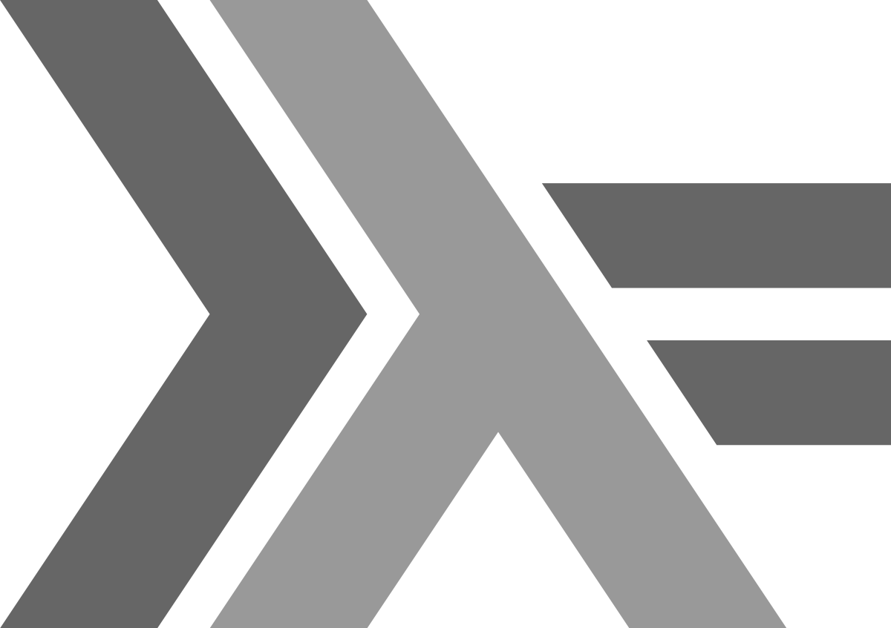

% Производительность и сложность алгоритмов в функциональных языках
% Михаил Беляев

## Проблема рекурсии

- Всем известно, что глубина рекурсии в (процедурных) программах ограничена
- Превышение ограничения приводит к переполнению стека

Что такое переполнение стека?

## Как происходят вызовы функций


Понятна, да, идея?

## Как происходят вызовы рекурсивных функций


- В чём тут проблема?

. . .

- Размер стека ограничен (и очень небольшим значением)

## Проблема

- В ФП любые множественные вычисления принято выражать через рекурсию
- Но есть переполнение стека
- Что делать?

. . .

Оптимизация хвостовых вызовов: общая идея


## Оптимизация хвостовых вызовов: реализация


- Очевидно, что нельзя так просто взять и перезаписать предыдущий кадр в стеке
- Там была какая-то нужная информация!

## Оптимизация хвостовых вызовов: реализация

{ height=8em }

Для того, чтобы иметь возможность перезаписывать кадр целиком, необходимо выполнить условия:

. . .

- Локальные переменные и аргументы не нужны
- Адрес возврата одинаков
- Результат одинаков

## Оптимизация хвостовых вызовов: практика

Для работы TCO необходимо, чтобы рекурсивный вызов был *последним* в теле функции

``` haskell
fact 0 = 1
fact 1 = 1
fact n = n * fact $ n - 1
```

. . .

``` haskell
tc_fact 0 k = k
tc_fact 1 k = k
tc_fact n k = tc_fact (n - 1) (k * n)
fact n = tc_fact n 1
```

## Оптимизация хвостовых вызовов: как это работает

Нехвостовой вызов:

:::::::::::::::::::::{.columns}
:::{.column width=35%}

``` haskell
fact 0 = 1
fact 1 = 1
fact n = n 
          * fact 
          $ n - 1
```
:::
:::{.column width=65%}


:::
::::::::::::::::::::::::::::::

## Оптимизация хвостовых вызовов: как это работает

Хвостовой вызов:

\setmonofont[Scale=0.8]{Fira Mono}

:::::::::::::::::::::{.columns}
:::{.column}

``` haskell
tc_fact 0 k = k
tc_fact 1 k = k
tc_fact n k = tc_fact (n - 1) 
                      (k * n)
fact n = tc_fact n 1
```
:::
:::{.column}


:::
::::::::::::::::::::::::::::::

## Оптимизация хвостовых вызовов: ещё пример

``` haskell
-- length of a list
length [] = 0
length (_:t) = 1 + length t
```

Это хвостовая рекурсия?

. . .

``` haskell
tc_length [] k = k
tc_length (_:t) k = tc_length t (k + 1)
length lst = tc_length lst 0
```

## Оптимизация хвостовых вызовов: ещё пример

``` haskell
-- sum of a list
sum [] = 0
sum (h:t) = sum t + h
```

Напишите хвосторекурсивный вариант самостоятельно

## Оптимизация хвостовых вызовов: реализации

- Работает практически в любом функциональном ЯП
- Реализована так же в большинстве "нативных" процедурных языков  
  (например, в большинстве компиляторов С)
- В "функционально-ориентированных" объектных языках её нет, что делает
  функциональное программирование на них забавной игрушкой  
  (Java, Python, etc.)

## Оптимизация хвостовых вызовов: Haskell

- Как ни странно, в Haskell TCO практически бесполезна из-за ленивости


## {.plain}

\centering


## Оценка сложности функциональных алгоритмов

- Большинство алгоритмов в ФП используют связные структуры данных
- Связные структуры данных "медленнее" массивов

Напрашивается вывод: ничего быстрого в ФП написать невозможно!

## Виды оценок сложности на практике

- Наихудшая сложность (worst-case complexity)
- Средняя сложность (average complexity)
- *Амортизированная* сложность (amortized complexity)
- Есть более сложные методы (вероятностные и т.д.)

## Вспоминаем начальную школу

Что такое $O$-нотация?

Что значит "алгоритм имеет сложность $O(N)$"?

А $O(log(N))$?

## Вспоминаем начальную школу

- Что такое `vector` (`ArrayList`, `Vector`, `dyn_array`)?
- Как он работает?

. . .

- Какова сложность основных операций над ним?
- Какого вида эта оценка сложности?

. . .

- Как она получается?

## Амортизированная сложность: метод агрегатов

Метод, основанный на усреднении множества операций

- Есть набор операций, для которых мы хотим найти сложность
- Нужно доказать, что для любой последовательности операций из этого набора
  средняя сложность на одну операцию равна заданной
- Вывод --- амортизированная сложность всех операций в наборе заданная

## Амортизированная сложность: метод агрегатов и вектор

Итак, рассмотрим набор операций: добавление в конец вектора, удаление из вектора

Для любого порядка этих операций либо каждая из них имеет сложность O(1) (если не было перевыделений),
либо есть операции с O(N), каждой из которых предшествует минимум N операций с O(1). Можно показать,
что в результате усреднения на каждую операцию приходится O(1)

Формально можете доказать дома самостоятельно

## Вопрос на подумать

Что будет, если в набор операций добавить ещё запрос размера?  
Добавление в середину?  
Добавление в начало?

## Амортизированная сложность: \newline проблемы метода агрегатов

- Как ни странно, простое усреднение сделать совсем непросто
- Требуется достаточное количество математики
- Не всегда легко доказать что-то для **любой** последовательности операций из набора

## Амортизированная сложность: \newline метод банкира и метод физика

- Чаще применяются на практике
- Зачастую значительно проще
- Сводятся друг к другу

## Метод банкира (или метод цен)

- В контексте РФ правильнее называть его "методом бухгалтера"

. . .

- Для каждой операции произвольно считаем, что нам за неё платят фиксированную "зарплату"
- За каждую примитивную операцию нужно заплатить (буквально) $1
- Максимально возможные убытки --- это и есть амортизированная стоимость операции

## Метод банкира и вектор

- Считаем, что добавление в конец приносит нам $3
- При этом $1 мы тут же тратим на собственно копирование элемента
- Каждое удаление элемента с конца стоит $1, который мы заработали (гарантированно!), когда его добавляли
- Если у нас есть вектор с N элементов, это значит, что мы заработали на нём не менее $N
- Если при добавлении нужно перевыделить память, мы тратим на эту операцию накопленные $N, оставаясь в плюсе

Отсюда вывод: добавление элемента в конец и удаление с конца --- это амортизированно константные операции

## Метод физика (или метод потенциалов)

- Строим функцию *потенциала* $\varphi$, определённую через внутреннее состояние системы
  - Потенциал не может быть взят "с потолка"
  - Потенциал не может опускаться ниже 0
- Если функция имеет сложность $A$ и *одновременно* уменьшает потенциал на $B$, эти события уравновешивают друг друга и сложность считается как $A - B$

## Метод физика и вектор

- Считаем, что потенциал вектора равен $N - (M - N)$ где $N$ --- число активных элементов, а $M$ --- размер массива
- Добавление в конец без перевыделения расходует $O(1)$ и увеличивает потенциал на 2, $O(1) + 2 = O(1)$
- Добавление в конец с перевыделением расходует $O(N)$ и уменьшает потенциал с $N$ до 0, $O(N - N) = O(1)$

. . .

- Удаление элемента -- ???

## Метод физика и вектор

- Считаем, что потенциал вектора равен $|N - (M - N)|$ где N --- число активных элементов, а M --- размер массива
- Добавление в конец без перевыделения расходует O(1) и увеличивает потенциал на 2, O(1) + 2 = O(1)
- Добавление в конец с перевыделением расходует O(N) и уменьшает потенциал с $N$ до 0, O(N) - N = O(1)
- Удаление с конца расходует O(1) и:
  - В верхней "половине" --- уменьшает потенциал на 2, O(1) - 2 = O(1)
  - В нижней "половине" --- увеличивает потенциал на 2, O(1) + 2 = O(1)

## Выводы

- Амортизированная сложность (вне зависимости от метода) имеет комплексную природу
- Нельзя посчитать сложность одного метода одним способом, а другого --- другим
- Амортизированная сложность некоторых операций может оказаться больше, чем их реальная сложность!

- Тем не менее, АС это верхняя оценка ВС на наборе операций, т.е. если всё доказано верно, она работает
  на практике лучше

## Причем тут ФП?

- Для структур на основе массивов характерны оценки наихудшей сложности
- Для связных структур зачастую важнее амортизированная сложность

## Пример

- Как описать на Haskell стек?

. . .

Очень просто: стек --- это просто односвязный список

. . .

- Как описать на Haskell очередь?

. . .

???

## Очередь на Haskell

``` haskell
data Queue a = Queue [a] [a]
```

*Идея*: очередь --- это **два** стека

1. Все входящие элементы кладём в стек входящих
1. Все исходящие берём из стека исходящих
1. Соблюдаем инвариант "стек исходящих не может быть пуст, если очередь не пуста"

## Очередь на Haskell


## Очередь на Haskell

``` haskell
enqueue :: Queue a -> a -> Queue a
enqueue (Queue [] []) x = Queue [] [x]
enqueue (Queue in out) x = Queue (x: in) out

dequeue :: Queue a -> (Queue a, a)
dequeue (Queue [] []) = error ""
dequeue (Queue in [x]) = (Queue [] (reverse in), x)
dequeue (Queue in (oe:ot)) = (Queue in ot, oe)
```

Утверждается, что данная очередь имеет амортизированную сложность O(1) на добавление и удаление

## Метод банкира

- Зарабатываем $1 при каждом добавлении и при каждом удалении
- При удалении "с перекидыванием" тратится $N, перед которым было гарантированно $N добавлений

## Метод физика

- Потенциал --- это размер входного стека
- Добавление в непустую очередь увеличивает $\varphi$ на 1
- Удаление "без перекидывания" не меняет $\varphi$
- Удаление "с перекидыванием" уменьшает $\varphi$ на $N$ и занимает O(N)

## Выводы

- "Средняя" сложность --- это ерунда, амортизированная сложность ftw
- Амортизированную сложность можно посчитать методами банкира или физика
- Это даёт простор для кучи интересных структур данных
- Но о них --- в одной из следующих лекций

## 

{ width=60% }


